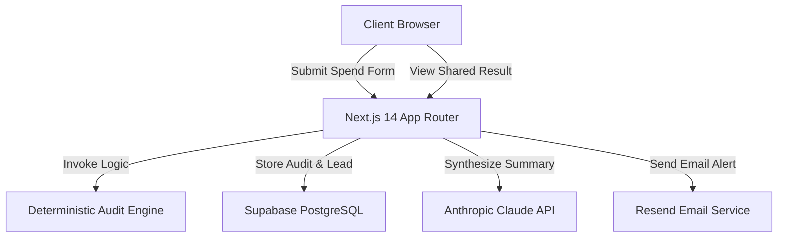

# SpendLens — System Architecture & Technical Specifications

SpendLens is architected to optimize for fast load times, deterministic data accuracy, cost-effective LLM operations, and maximum resilience. This document outlines the system components, data schemas, API communication flows, and design decisions.

## System Topology & Tech Stack



- **Next.js 14 App Router**: Selected to combine Server Side Rendering (SSR) for dynamic Open Graph preview tags with fast Server Actions/API handlers in a single consolidated workspace.
- **Supabase (PostgreSQL)**: Handles relational data storage (audits and captured leads) with simple, standard postgres connections.
- **Resend**: Chosen for high deliverability, simple transactional email setup, and clean DX.
- **Anthropic Claude API**: Leveraged to synthesize highly readable summaries, converting raw audit stats into a 2-sentence conversational insight paragraph.
- **Vitest**: Used as a fast, ES-module-native replacement for Jest, keeping test-driven development fast and lightweight.

---

## Data Flow Diagram (Audit Submission)

1. **Client Form Validation**: User completes tool spend fields. Component performs local validation, stores the transient state in `localStorage` (key: `spendlens_form_state`), and posts to `/api/audit`.
2. **Deterministic Processing**: `/api/audit` applies rule-based calculations in `lib/audit-engine.ts`. Calculations are completely offline, free, and instantly predictable.
3. **Database Capture**: Audit result is saved as an anonymous database row. The database automatically generates a unique `public_token` (UUID).
4. **Asynchronous Summary**: The client receives the `public_token` and immediately makes a subsequent asynchronous post request to `/api/summary`. If the Anthropic API is rate-limited or disabled, a local deterministic script generates a fallback summary block, avoiding blockages.
5. **Lead Capture & Emailing**: High-savings teams can opt to enter their email lead information. Doing so updates the record at `/api/lead` and triggers a customized Resend transaction email outlining their potential savings.

---

## Database Schema (PostgreSQL DDL)

SpendLens leverages PostgreSQL schemas managed in Supabase. Relational columns are optimized with conditional indexing for lightning-fast queries:

```sql
-- Audits table: stores every completed audit
CREATE TABLE audits (
  id UUID DEFAULT gen_random_uuid() PRIMARY KEY,
  created_at TIMESTAMPTZ DEFAULT now(),
  
  -- Input data
  team_size INTEGER NOT NULL,
  primary_use_case TEXT NOT NULL CHECK (primary_use_case IN ('coding','writing','data','research','mixed')),
  tools JSONB NOT NULL,  -- Array of {tool_id, plan_id, monthly_spend, seats}
  
  -- Computed results
  total_monthly_spend NUMERIC(10,2) NOT NULL,
  total_monthly_savings NUMERIC(10,2) NOT NULL,
  total_annual_savings NUMERIC(10,2) NOT NULL,
  recommendations JSONB NOT NULL,  -- Array of recommendation objects
  
  -- AI summary
  ai_summary TEXT,
  
  -- Public share data (no PII)
  public_token UUID DEFAULT gen_random_uuid() UNIQUE NOT NULL,
  
  -- Lead capture (nullable until captured)
  email TEXT,
  company_name TEXT,
  role TEXT,
  lead_captured_at TIMESTAMPTZ,
  
  -- Metadata
  ip_hash TEXT,  -- Hashed for abuse detection
  user_agent TEXT
);

-- Index for fast public URL lookups
CREATE INDEX idx_audits_public_token ON audits(public_token);

-- Index for lead analysis
CREATE INDEX idx_audits_lead_captured ON audits(lead_captured_at) WHERE lead_captured_at IS NOT NULL;
```

---

## Core Architectural Trade-off: Deterministic vs. Generative Engine

To keep our core calculations fast, auditable, and mathematically flawless, we decouple the Spend Audit logic:

| Feature Dimension | Deterministic Engine (`lib/audit-engine.ts`) | Generative Engine (`/api/summary`) |
| :--- | :--- | :--- |
| **Responsibility** | Calculating monthly/annual savings, plan downgrades, alternative switches. | Producing cohesive, friendly, and narrative summaries. |
| **Tech Stack** | Local TypeScript/Node execution (0ms network delay, free). | Claude 3.5 Haiku API. |
| **Reasoning** | Pure mathematical rules, list pricing matches, and clear redundancy detections. | Natural language packaging, making tables scannable. |
| **Fail-safe Design**| 100% reliable. Zero hallucinations or pricing inaccuracies. | Graceful local fallback engine triggers if key is missing/rate-limited. |
