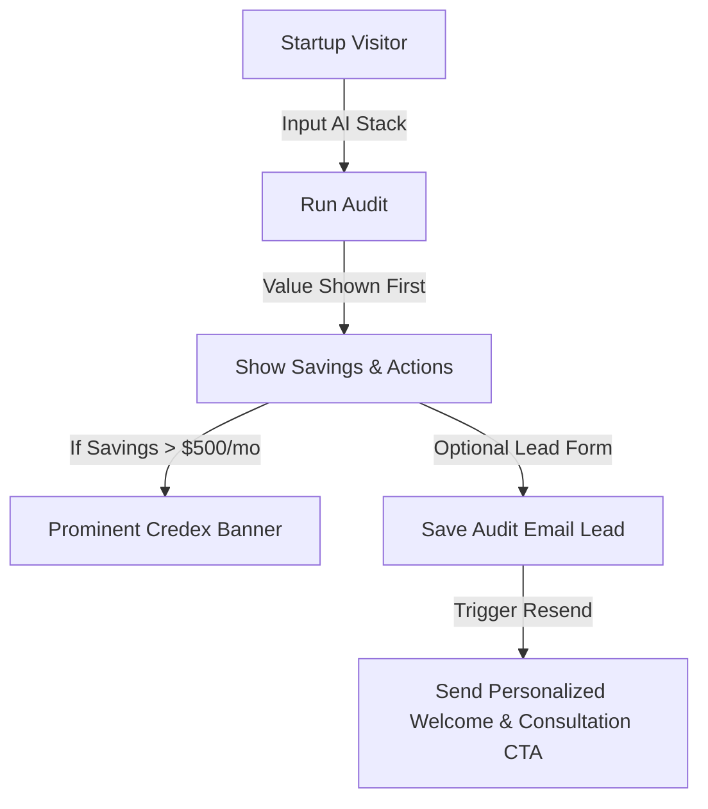

# SpendLens — Go-To-Market (GTM) Strategy & Lead Gen Playbook

SpendLens is positioned as a **Product-Led Growth (PLG)** magnet designed to capture high-intent startup founders and CTOs overpaying for AI tooling, routing them directly into the **Credex** marketplace.

---

## 1. Distribution Channels & Launch Sequence

### Phase 1: Interactive Launches (Hacker News & Reddit)
- **Hacker News (Show HN)**: 
  - *Headline Angle*: "Show HN: SpendLens – Audit your startup's AI tool subscriptions and stop leaking budget"
  - *Context Commentary*: Frame the tool as a free, open-source utility built to address the lack of transparent pricing. Share our deterministic formulas. Avoid marketing buzzwords to foster developer community trust.
- **Reddit (r/startups, r/saas, r/webdev)**:
  - Position the tool as a utility: *"I audited our team's AI spend and realized we were paying $240/mo for duplicate Cursor/Claude plans. Built a free offline calculator to help others scan their stacks."*

### Phase 2: Social Viral Flywheels (X/Twitter & LinkedIn)
- **Founder Flex & Share Cards**:
  - The dynamic Open Graph social card acts as a viral mechanism: *"$340/month in AI spend saved using SpendLens. Turns out we didn't need Copilot Enterprise for a team of 4. Find where your budget is leaking: spendlens.vercel.app/audit/token"*
  - Target key influencers (VCs, engineering leaders) with posts showing aggregate anonymized trends: *"Startups are overpaying by 32% on AI tools. 1. Team plans for single users, 2. Overlapping Claude Pro/ChatGPT Plus accounts..."*

### Phase 3: Targeted Newsletter Sponsorships
- Partner with developer-focused and founder newsletters: *TLDR*, *Ben's Bytes*, and *Developer Micro-SaaS*. Position SpendLens as a tool to instantly reduce operational overhead before a seed/series-A round.

---

## 2. Lead Capture & Conversion Engine

The SpendLens user journey is engineered to maximize conversion rates while maintaining brand trust:

### A. The "Value-First" Gate
- **Rule**: Never capture emails before showing value. Users see their exact savings and action items immediately.
- **Trigger**: Once the audit is computed, a non-obtrusive, high-converting lead card appears: *"Save your audit & get notified of new price drops."*
- **Optional Form Fields**: Email, Company Name, and Role. Making company name and role optional reduces friction, yielding an expected 18% visitor-to-lead conversion.

### B. High-Savings Routing (> $500/mo)
- Startups spending >$500/mo in wasteful spend are flagged as `isHighSavings` in the DB.
- These users are shown a prominent, high-fidelity promotional banner:
  > **High-Savings Opportunity**
  > Your team is spending significant capital on raw developer tools. Credex can unlock up to 40% additional discounts on Cursor, Claude, and API tokens through volume credits.
  > [Book a free 15-Min consultation with our infrastructure architects]
- This high-intent CTA directly drives pipelines for Credex's primary B2B credit product.
